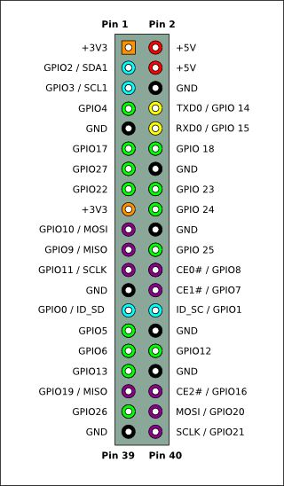
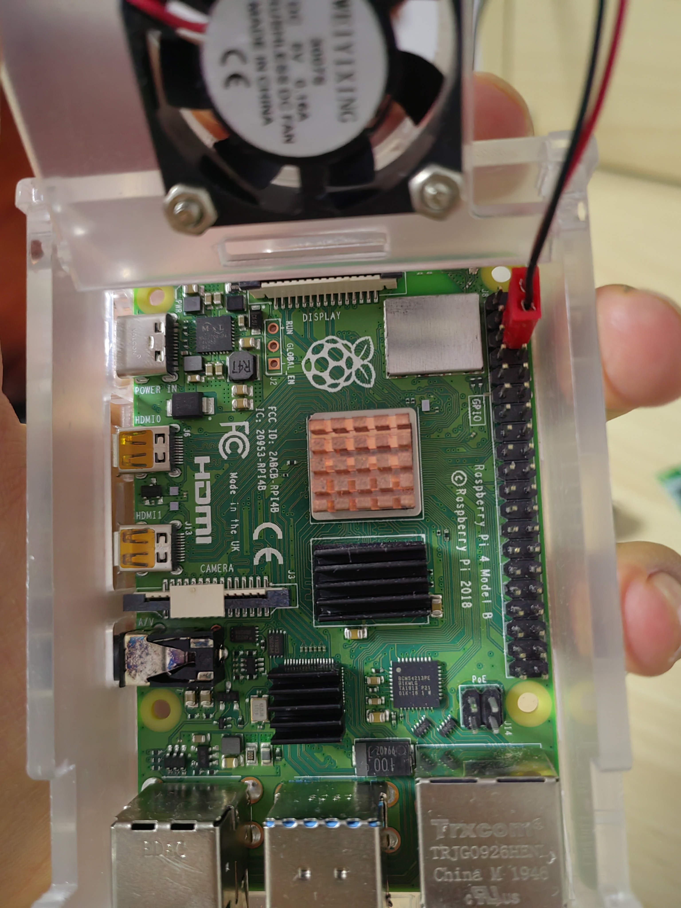

### 第一课-搭建嵌入式开发环境
#### 什么是嵌入式编程
引用自百度百科 [链接](https://baike.baidu.com/item/%E5%B5%8C%E5%85%A5%E5%BC%8F%E5%BC%80%E5%8F%91/86149#:~:text=%E5%B5%8C%E5%85%A5%E5%BC%8F%E5%BC%80%E5%8F%91%E6%98%AF%E6%8C%87%E5%88%A9,%E6%95%B4%E4%B8%AA%E7%B3%BB%E7%BB%9F%E7%9A%84%E5%BC%80%E5%8F%91%E3%80%82)
> 
> 嵌入式开发是指利用分立元件或集成器件进行电路设计、结构设计，再进行软件编程（通常是高级语言），实验，经过多轮修改设计、制作，最终完成整个系统的开发。这种嵌入式开发，适用于未来产品比较单一，产量比较大，产品开发周期比较长，成本控制比较严格的系统。
> 
> 嵌入式系统国内普遍认同的定义是：以计算机技术为基础，以应用为中心，软件、硬件可剪裁，适合应用系统对功能可靠性、成本、体积、功耗严格要求的专业计算机系统。在构成上，嵌入式系统以微处理器及软件为核心部件，两者缺一不可；在特征上，嵌入式系统具有方便、灵活地嵌入到其他应用系统的特征，即具有很强的嵌入性。
> 按嵌入式微处理器类型划分，嵌入式系统可分为以单片机为核心的嵌入式单片机系统；以工业计算机板为核心的嵌入式计算机系统；以DSP为核心组成的嵌入式数字信号处理器系统；以FPGA为核心的嵌入式SOPC（System On a Programmable Chip，可编程片上系统）系统等。

#### 洛书可以参与到嵌入式吗
答案是肯定的(要不作者还写这文章干嘛 :smirk: )

现阶段(是指现有的，标准版的洛书，先不考虑移植版的)，洛书便可以参与到嵌入式开发当中
#### 如何用洛书进行嵌入式编程
+ 首先，您的嵌入式平台上要有一个解释器，这是洛书程序运行的基础。如果您是大佬，您也可以考虑写一个本地化编译器，将洛书指令编译成平台支持的二进制
+ 其次，您要有一台安装了LPK的计算机(宿主机)，如果您的嵌入式平台资源充足，您可以直接将LPK安装到其上。
+ 您要会用洛书编写程序。

#### 内容
不仅会教给您一些基本的嵌入式编程知识，还会告诉您一些底层的理论。
同时还会让您了解到，如何开发洛书的嵌入式库。

#### 如何安装洛书
笔者的硬件是一块树莓派4b，因为[qiong]，把嵌入式与linux二合一购买了
所以这里的教程基本是基于嵌入式系统的。当然，您也可以移植洛书解释器到单片机上玩
树莓派zero系列，香橙派，还有x86系列的开发版都是可以考虑的，甚至鸿蒙的开发版也可以玩

+ 1. 在宿主机（笔者是ubuntu20.4）上安装洛书 比如1.0LTS版本。
+ 2. 在嵌入式上安装洛书，如果是树莓派这种，直接视作linux，一键安装
>如果不是，推荐下载源码，通过交互式编译器编译解释器安装
>注意，如果您的平台不支持加载动态库(Linux加载动态库需要glibc),您可以将所有需要的方法加到解释器内部，用-static 编译成只要一个内核就能启动的程序
+ 3. 用你喜欢的办法实现宿主机向嵌入式设备传递文件。串口，FTP，U盘拷贝……怎么方便怎么办

在极端情况下，您只需要一个linux内核加一个文件系统就可以运行标准版的洛书
也就是说，洛书完全可以像JAVA写安卓那样写系统(大饼)

#### 附赠一张树莓派的引脚图

