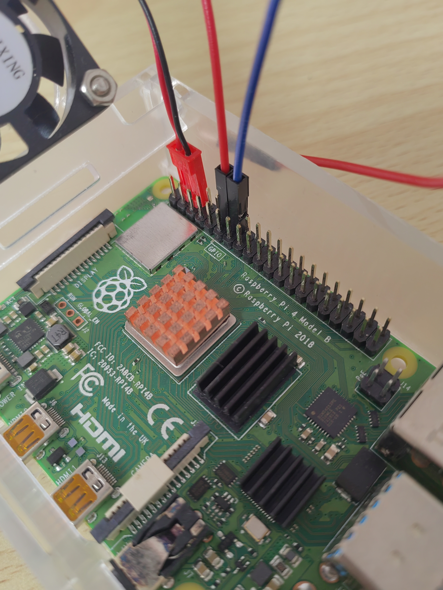
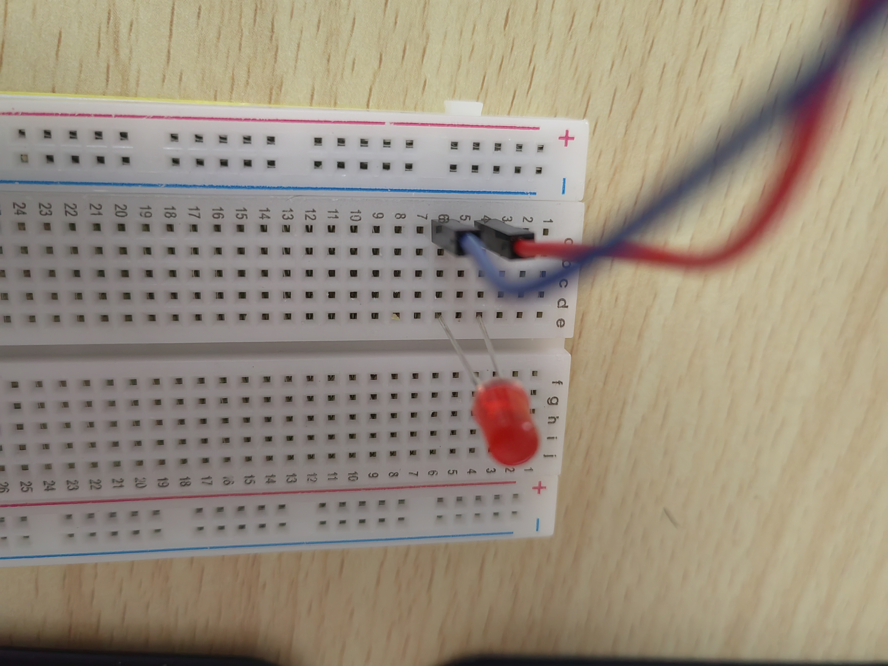
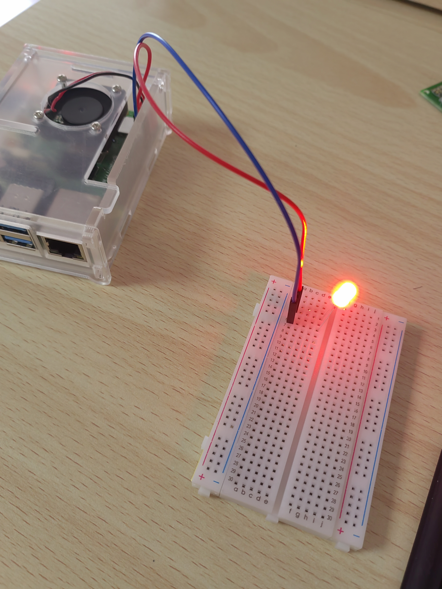

### 电路图

很简单的一个电路。

### 整理思路
1. 我们要拥有一个电源与接地端，这个电源可以用程序控制
2. 对于树莓派等支持GPIO的设备，当GPIO以输出模式输出高电平(3.3V)，可以将GPIO端口视作电源.
3. 接地端口视作接地线
4. 我们需要一个控制gpio端口的程序

很幸运，洛书的标准类中有引脚(gpio)类(后续章节再详细解说)

那我们需要的，就是编写一个程序，通过改变特定引脚的电压，来实现灯珠的亮灭

在本教程中，使用的是树莓派4b的18号gpio端口。

### 编写程序
文件名 点灯.losu
```
+加载 开始
+导入 洛书/标准流
+导入 洛书/引脚
+标准流 标准流
+引脚 引脚18
+方法 开始()
{
    引脚18.设定("18","1")
    引脚18.写入("1")
    标准流.等待("1000")
    引脚18.写入("0")
    引脚18.卸载()
}
```

代码解释

```
引脚18.设定("18","1")
//将实例 引脚18 设定为18引脚，输出模式

引脚18.写入("1")
//设定为高电平

标准流.等待("1000")
//等待1000毫秒


引脚18.写入("0")
//设定为低电平

引脚18.卸载()
//好习惯，将18号引脚从gnu里卸载掉，删去也无妨
```
您可能会问，洛书基本库中到底包含了哪些方法，如何获取这些方法的用法

洛书是开源的，基本库也是开源的，基本库由洛书代码写成，里面的注释中会带有方法的属性与用法


### 连接电路
####  **！！！强烈建议！！！**
 **接线时不要给嵌入式设备通电，除非您有能力保证不会接错电路** 


如图，红色跳线接在18号引脚上，蓝色跳线接在GND(接地)引脚上。(忽略那个红色的插头，那是作者的风扇电源线)

面包板上的接线效果(如果有必要，您得接个限流电阻)
<br>注意，二极管是有极性的，正负极不能接反


### 编译，执行代码
+ 笔者是在Ubuntu上编译的源代码，然后拷到树莓派上运行的。如果您在Windows上编译，一定要注意，将输出文件转换为UTF-8格式，LF结尾换行
+ 运行时最好拥有sudo权限，如果像直接作为可执行脚本执行，还需要用chmod赋予755值
+ 可以通过设置IDE的生成选项，一次性完成编译与运行授权

效果图

