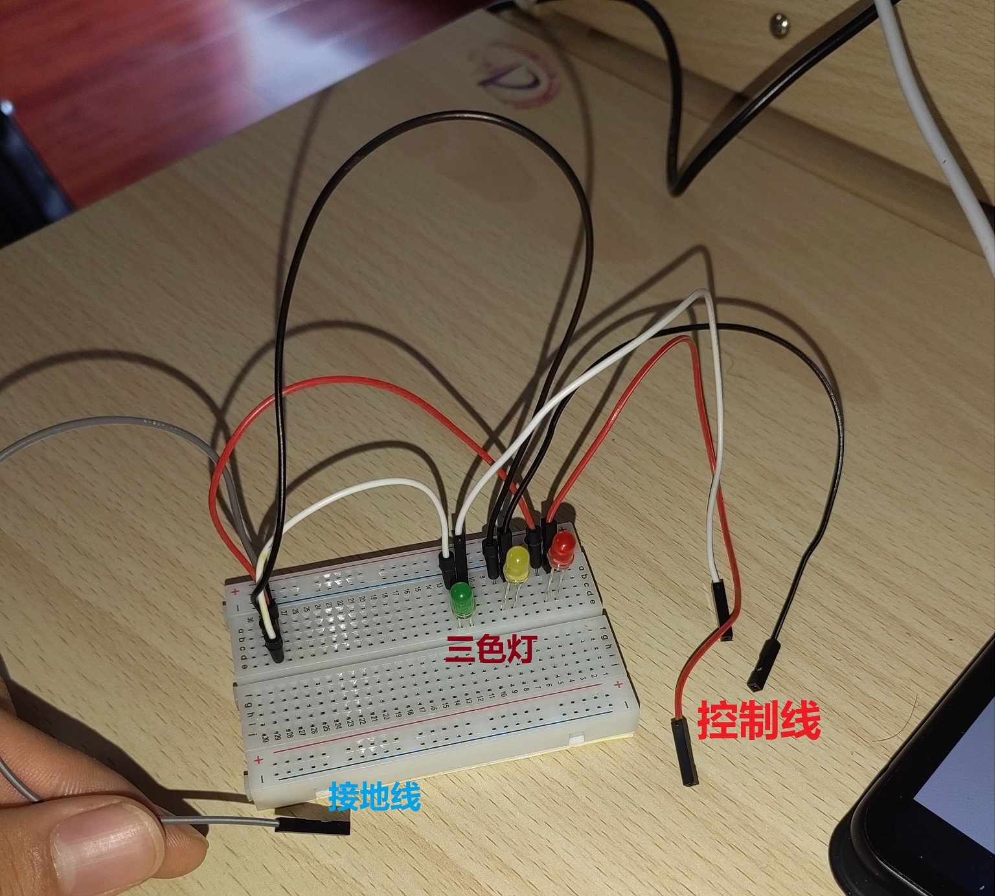

### 制作一个交通灯小设备
#### 原料 
+ 3色LED灯
+ 导线若干
#### 电路原理
3个LED，正极分别引出，作为引脚接口，负极接地，可以将三个支路并线后再接地
#### 硬件制作
直接上图

你也可以把它装到乐高积木里，这样更美观

#### 编写封装类
直接上代码
1.河图版，编译时会提示缺少csip，可忽略，编译生成.losu文件，可以正常的移植到工程中
<br>直接用python的语法高亮插件 :joy: 


```
#导入 洛书/引脚
#导入 洛书/标准流
#标准流 程序
+类 交通灯
    #引脚 [此类].红灯
    #引脚 [此类].黄灯
    #引脚 [此类].绿灯
    @方法 配置(红灯,黄灯,绿灯)
        <[此类].红灯> = 红灯
        <[此类].黄灯> = 黄灯
        <[此类].绿灯> = 绿灯
        [此类].红灯.设定(<[此类].红灯>,"1")
        [此类].黄灯.设定(<[此类].黄灯>,"1")
        [此类].绿灯.设定(<[此类].绿灯>,"1")
        +回收 红灯
        +回收 黄灯
        +回收 绿灯
    @方法 红灯()
        @方法 点亮()
            [此类].红灯.写入("1")
        @方法 熄灭()
            [此类].红灯.写入("0")
    @方法 黄灯()
        @方法 闪烁()
            +循环("5")
                [此类].黄灯.写入("1")
                程序.等待("100")
                [此类].黄灯.写入("0")
                程序.等待("100")
    @方法 绿灯()
        @方法 点亮()
            [此类].绿灯.写入("1")
        @方法 熄灭()
            [此类].绿灯.写入("0")
```


洛书标准版

```
+导入 洛书/引脚
+导入 洛书/标准流
+标准流 程序
+类 交通灯
{
    +引脚 [此类].红灯
    +引脚 [此类].黄灯
    +引脚 [此类].绿灯
    +方法 配置(红灯,黄灯,绿灯)
    {
        <[此类].红灯> = 红灯
        <[此类].黄灯> = 黄灯
        <[此类].绿灯> = 绿灯
        [此类].红灯.设定(<[此类].红灯>,"1")
        [此类].黄灯.设定(<[此类].黄灯>,"1")
        [此类].绿灯.设定(<[此类].绿灯>,"1")
        +回收 红灯
        +回收 黄灯
        +回收 绿灯
    }
    +方法 红灯()
    {
        +方法 点亮()
        {
            [此类].红灯.写入("1")
        }
        +方法 熄灭()
        {
            [此类].红灯.写入("0")
        }
    }
    +方法 黄灯()
    {
        +方法 闪烁()
        {
            +循环("5")
            {
                [此类].黄灯.写入("1")
                程序.等待("100")
                [此类].黄灯.写入("0")
                程序.等待("100")
            }
        }
    }
    +方法 绿灯()
    {
        +方法 点亮()
        {
            [此类].绿灯.写入("1")
        }
        +方法 熄灭()
        {
            [此类].绿灯.写入("0")
        }
    }
}
```
