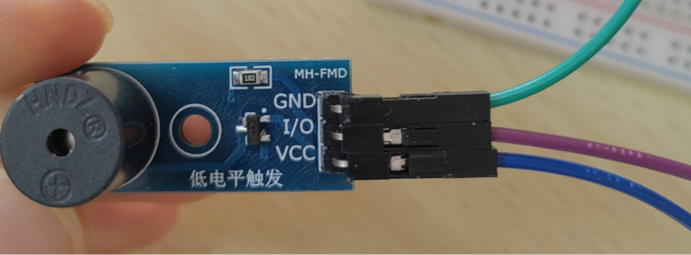
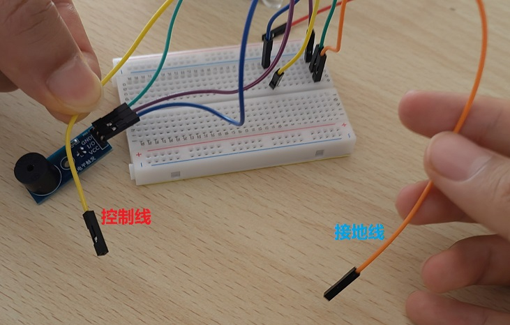

### 蜂鸣器
直接上原理图与代码
#### 设备接线图



我们把I/O与GND同时接地，当VCC引脚处于高电位时，便可触发蜂鸣器

#### 设备驱动类
蜂鸣器.hetu(编译为 蜂鸣器.losu/蜂鸣器.lsc)
```
#导入 洛书/引脚
#导入 洛书/标准流
#标准流 程序
+类 蜂鸣器
    #引脚 [此类].蜂鸣器
    @方法 配置(引脚)
        [此类].蜂鸣器.设定(引脚,"1")
        +回收 引脚
    //启动蜂鸣器 以毫秒计时
    @方法 蜂鸣(毫秒)
        [此类].蜂鸣器.写入("1")
        程序.等待(毫秒)
        [此类].蜂鸣器.写入("0")
```
#### 测试程序


发出一段SOS信号 3短3长3短 9声蜂鸣

文件名 测试.hetu 工作目录下应拥有 蜂鸣器.lsc
```
#加载 开始
#导入 洛书/标准流
#引用 蜂鸣器
#标准流 程序
#蜂鸣器 蜂鸣器
/*
    控制蜂鸣器发出SOS信号
@方法 开始()
    蜂鸣器.配置("21")
    +循环("3")
        蜂鸣器.蜂鸣("200")
        程序.等待("100")
    +循环("3")
        蜂鸣器.蜂鸣("1000")
        程序.等待("100")
    +循环("3")
        蜂鸣器.蜂鸣("200")
        程序.等待("100")
```
