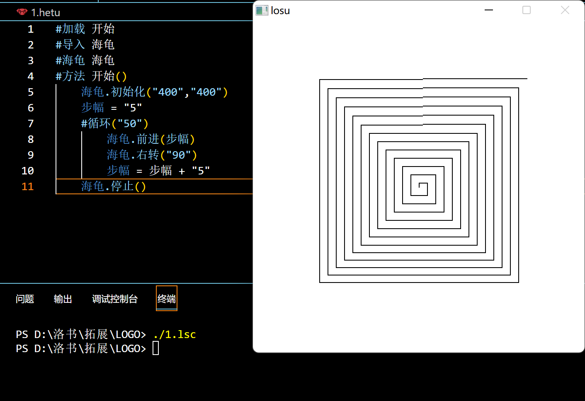
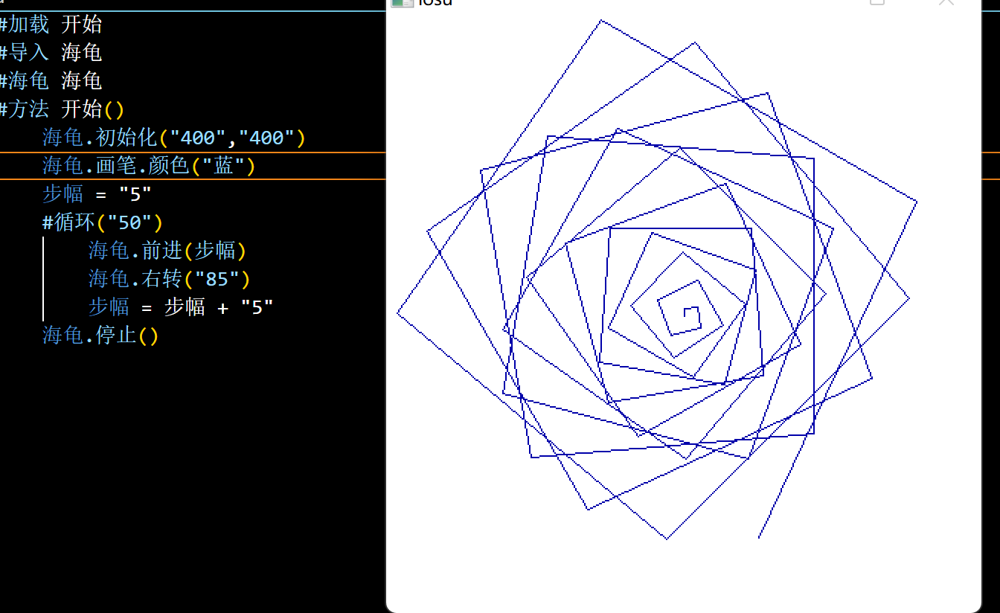
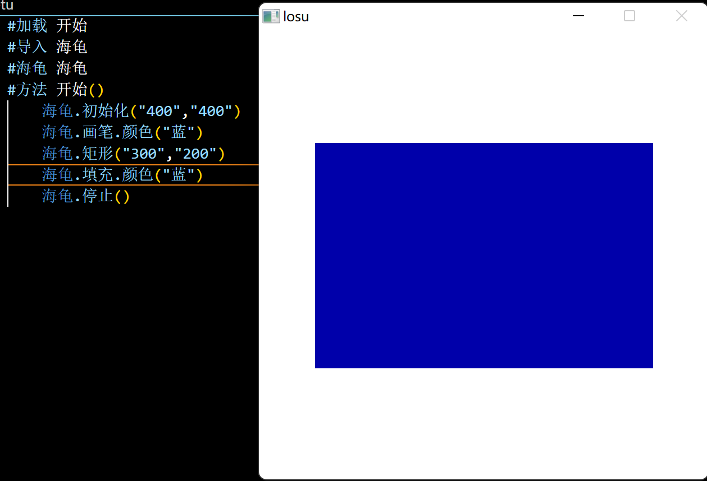

## 基本信息
```
    Information
    LOSU expand_pac  logo_graphic based on EasyX or libgraph
    This can work on losu1.0_LTS+
    (c) chen-chaochen
    GPL-3.0

    基本信息
    一个类似于LOGO的拓展库，基于EasyX或者libgrapth封装实现
    适用于 洛书1.0LTS 及以上的版本
    (c) 陈朝臣
    代码遵循 GPL-3.0 协议
```

## 安装方式
1. 下载 海龟.losu。运行命令```losuc 海龟```编译出```海龟.lsc```
2. 下载合适的.lsd(x86/x64)文件，linux平台需安装libgraph并从源码编译生成.lsd文件
3. 将lsd文件复制到 LS_ROOT/lvm 目录下(Windows下默认 LS_ROOT = C:\losu)
4. 将海龟.lsc复制到 LS_ROOT/inc 目录下

## 使用文档
### 色彩
#### 调色
+ RGB调色模式，一个颜色由9位数据表示，三位分别表示R,G,B。范围0~255
+ 如 255000000(鲜红) 255255255(纯白) 000000000(纯黑)

#### 颜色
内置的颜色常量
```
        "黑",
        "蓝",
        "绿",
        "青",
        "红",
        "紫",
        "棕",
        "浅灰",
        "深灰",
        "亮蓝",
        "亮绿",
        "亮青",
        "亮红",
        "亮紫",
        "黄",
        "白"
```
### 内置函数

```
.初始化(长,宽)    //初始化一个指定大小绘图窗口。

.调整大小(长,宽)    //调整绘图窗口大小。

.关闭()    //关闭绘图窗口

.停止()    //停止绘图，保留窗口，挂起整个程序

.输出(字符)/.输入()/.等待(毫秒)    //从标准流继承来的，用法一样

.清空()    //清空绘图窗口

.加载图片(图片名)    //加载图片并显示在绘图区

.另存为(图片名)    //将窗口里的图形另存在图片中

.背景.颜色(颜色名)    //将背景设置为颜色(颜色名)

.背景.调色(RGB)    //将背景设置为RGB值

.画笔.颜色(颜色名)    //将画笔设置为颜色(颜色名)

.画笔.调色(RGB)    //将画笔设置为RGB值

.抬笔()    //抬笔，移动时不留下线条

.落笔()    //移动留下线条(默认)

.前进(步数)    //前进指定步数

.后退(步数)    //后退指定步数

.左转(度数)    //左转指定度数

.右转(度数)    //右转指定度数

.定位(x,y)    //定位到指定坐标(以窗口中心为原点，向右为x轴正方向，向上为y轴正方向)

.归位()    //回到原点，且角度归零

.圆(半径)    //以当前位置为中心，画一个指定半径的圆

.椭圆(a,b)    //以当前位置为中心，画一个 (x/a)^2 + (y/b)^2 = 1 的椭圆(a>b>0或b>a>0)

.矩形(长,宽)    //以当前位置为中心，画一个指定长宽的矩形

.点()    //在当前位置画个点

.填充.颜色(颜色名)    //在当前位置，以指定颜色，填充画笔颜色围成的封闭区域

.填充.调色(RGB)    //在当前位置，以RGB，填充画笔颜色围成的封闭区域
```

### 示例
#### 画螺线



```
#加载 开始
#导入 海龟
#海龟 海龟
#方法 开始()
    海龟.初始化("400","400")
    步幅 = "5"
    #循环("50")
        海龟.前进(步幅)
        海龟.右转("90")
        步幅 = 步幅 + "5"
    海龟.停止()
```



```
#加载 开始
#导入 海龟
#海龟 海龟
#方法 开始()
    海龟.初始化("400","400")
    海龟.画笔.颜色("蓝")
    步幅 = "5"
    #循环("50")
        海龟.前进(步幅)
        海龟.右转("85")
        步幅 = 步幅 + "5"
    海龟.停止()
```


#### 填充


```
#加载 开始
#导入 海龟
#海龟 海龟
#方法 开始()
    海龟.初始化("400","400")
    海龟.画笔.颜色("蓝")
    海龟.矩形("300","200")
    海龟.填充.颜色("蓝")
    海龟.停止()
```

